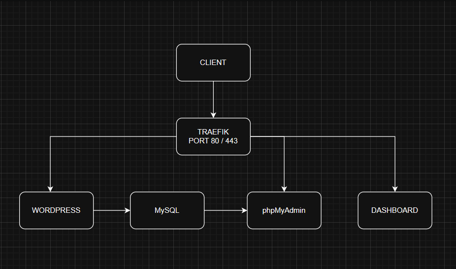

# Deploy WordPress & phpMyAdmin with Traefik and Docker

This project provides a straightforward way to deploy a WordPress site and phpMyAdmin using Docker. Traefik is used as a reverse proxy to automatically handle HTTPS certificates from Let's Encrypt.

---

## Topology



## Prerequisites

Before you begin, make sure you have the following installed on your server:

- **Docker**
- **Docker Compose**

You will also need a **domain name** pointed to your server's IP address.

---

## Getting Started

Follow these steps to get your WordPress site up and running.

### 1. Clone the Repository

First, clone this repository to your server.

```bash
git clone https://github.com/Rullabcde/traefik.git
```

### 2. Create `acme.json` for SSL

Traefik uses this file to store your SSL certificates.

```bash
touch traefik/acme.json
chmod 600 traefik/acme.json
```

### 3. Configure Your Domain

Open the `docker-compose.yml` file and replace `domain.anda` with your actual domain name in the labels for the `wordpress` and `phpmyadmin` services.

### 4. Set Your Email and Domain in `traefik.yml`

Open `traefik/traefik.yml` and change the email address, hashed user and password to your own.

```yaml
# traefik/traefik.yml
---
dashboard-auth:
  basicAuth:
    users:
      - "user:passwordhash"

certificatesResolvers:
  letsencrypt:
    acme:
      email: email@gmail.com
```

### 5. Create and Configure the `.env` File

Create a `.env` file by copying the example file (if you have one) or creating it from scratch. Then, fill in the required environment variables.

```env
# MySQL
MYSQL_ROOT_PASSWORD=your_root_password
MYSQL_DATABASE=wordpress_db
MYSQL_USER=wordpress_user
MYSQL_PASSWORD=your_password

# WordPress
WORDPRESS_DB_HOST=mysql:3306
WORDPRESS_DB_NAME=wordpress_db
WORDPRESS_DB_USER=wordpress_user
WORDPRESS_DB_PASSWORD=your_password

# phpMyAdmin
PMA_HOST=mysql
PMA_PORT=3306
PMA_ABSOLUTE_URI=https://domain.anda/phpmyadmin
```

### 6. Launch the Application

Now you're ready to start all the services.

```bash
docker-compose up -d
```

Your WordPress site will be available at `https://domain.anda`, and phpMyAdmin will be at `https://domain.anda/phpmyadmin`. Traefik will automatically obtain and renew the SSL certificates for you.
Additionally, the Traefik dashboard will be available at `https://traefik.domain.anda`.
